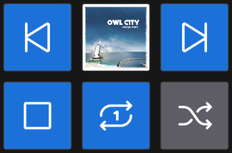

# MPRIS2 Media for OpenDeck

Simple Linux media controls for OpenDeck using MPRIS2.

This plugin lets your Stream Deck control a specific media player instead of whichever MPRIS2 player D-Bus happens to return first. It was created primarily for Strawberry, but it can work with other MPRIS2-compatible players.

## Features

- Album artwork, including automatic 2×2 and 3×3 cover layouts
- Play / Pause
- Stop
- Previous / Next
- Repeat
- Shuffle
- Seek backward / forward 10 seconds
- Volume down / up 5%
- One shared media-player selection for all plugin buttons
- Automatically reconnects when a selected player is closed and reopened



# Installation

> [!IMPORTANT]
> **This plugin is for Linux and OpenDeck.** It is not an official Elgato Stream Deck plugin and is not intended for the official Stream Deck software on Windows or macOS.

## Recommended: install the release package

1. Open the [latest GitHub release](https://github.com/cooldead/opendeck-mpris2/releases/latest).
2. Download the `.streamDeckPlugin` file for your system.
3. Open **OpenDeck**.
4. Import/install the downloaded `.streamDeckPlugin` file using OpenDeck's plugin import feature.
5. Restart OpenDeck if the new actions do not appear immediately.
6. Find **MPRIS2 Media** in the OpenDeck action list and drag the controls you want onto your deck.

For most users, **you do not need Rust, Python, Node.js, or playerctl installed**. Those are only needed when building the plugin from source.

> [!WARNING]
> **If you already use the original “Linux Media” plugin, its existing buttons will not automatically become MPRIS2 Media buttons.** This plugin has its own ID (`com.cooldead.mpris2`). Add new **MPRIS2 Media** actions to your deck. Both plugins can be installed at the same time.

## Choose your media player

Select an **Album Artwork** or **Play/Pause** button in OpenDeck. In its settings, use **Media player — all plugin controls** to choose the player you want to control.

That selection is shared by every MPRIS2 Media button, including buttons on other profiles, and is remembered after OpenDeck restarts.

The player list refreshes while the settings panel is open. You can also press **Refresh players**.

**Automatic (prefer playing)** tries to use a currently playing player first, then Strawberry, then another available MPRIS2 player. If you explicitly select a player, the plugin will not silently switch to a different application when that player closes.

> [!IMPORTANT]
> Your media player must support **MPRIS2** and must be available in the **same desktop user session as OpenDeck**. If the player is running but does not appear in the list, this is one of the first things to check.

### Strawberry

Strawberry works with this plugin through its MPRIS2 support. Make sure Strawberry is running and MPRIS2 integration is enabled.

Its normal D-Bus service is `org.mpris.MediaPlayer2.strawberry`.

Strawberry MPRIS2 documentation: https://wiki.strawberrymusicplayer.org/wiki/Using_MPRIS2

## Album artwork

Add an **Album Artwork** action to display the current cover.

The plugin supports PNG, JPEG, GIF, and WebP artwork from local files, HTTP/HTTPS URLs, and base64 image data. Missing or unreadable artwork falls back to the default record icon.

### 2×2 or 3×3 large covers

For a larger cover, place Album Artwork buttons next to each other:

```text
2×2          3×3
1 2          1 2 3
3 4          4 5 6
             7 8 9
```

Leave **Artwork layout** set to **Auto**. The plugin detects complete adjacent 2×2 and 3×3 groups and assigns each button its part of the image automatically.

Incomplete groups stay as normal full-cover buttons. You can also choose **Single button** or manually select a grid and tile position.

> [!NOTE]
> The physical gaps between Stream Deck buttons remain visible. The plugin does not attempt to compensate for the spacing between keys.

# Troubleshooting

### The plugin installed, but I don't see its buttons

Restart OpenDeck and make sure you are looking for **MPRIS2 Media**, not **Linux Media**.

### My media player doesn't appear

Make sure the player:

- is currently running;
- supports MPRIS2;
- has MPRIS2 integration enabled, if the application provides an option for it; and
- is running in the same user's desktop session as OpenDeck.

### Flatpak users

> [!WARNING]
> **Flatpak sandbox permissions can prevent OpenDeck from communicating with your media player's session D-Bus service.** If the plugin installs correctly but cannot see or control any players, check the Flatpak permissions before assuming the plugin is broken.

### A button says Offline

`Offline` normally means the selected player is not currently available. Start the player again and the plugin should reconnect automatically.

### Repeat or Shuffle does not work correctly

Some MPRIS2 players do not implement every optional MPRIS property. Repeat and Shuffle behavior therefore depends on what the selected player exposes.

### Plugin log

OpenDeck normally stores the plugin log here:

```text
~/.local/share/opendeck/logs/plugins/com.cooldead.mpris2.sdPlugin.log
```

# Building from source

You only need this section if you want to develop or build the plugin yourself.

Requirements:

- Linux
- Current stable Rust toolchain
- Python 3
- OpenDeck for testing

Build and package it with:

```sh
python3 scripts/package.py
```

Packages are written to `dist/` as `.streamDeckPlugin` files. Native x86_64 and aarch64 GNU/Linux builds are supported, with one architecture per package.

> [!CAUTION]
> **Locally compiled builds depend on the glibc available on the build system.** A package built on a newer Linux distribution may not run on a system with an older glibc. The project's GitHub Actions builds use Ubuntu 24.04 to provide broader compatibility.

For a manual non-package installation, close OpenDeck and copy:

```text
dist/<architecture>/com.cooldead.mpris2.sdPlugin
```

to:

```text
${XDG_CONFIG_HOME:-$HOME/.config}/opendeck/plugins/
```

Then reopen OpenDeck.

## Development checks

```sh
cargo fmt --check
cargo clippy --locked --all-targets -- -D warnings
cargo test --locked
dbus-run-session -- cargo test --locked -- --ignored
node --test tests/inspector.cjs
```

The ignored tests require local sockets and an isolated session D-Bus. Physical Stream Deck behavior and the OpenDeck inspector should still be checked manually before publishing a release.

# AI-assisted development disclosure

AI tools were used during development of this project to assist with tasks such as code generation, debugging, refactoring, documentation, and development workflow.

AI-generated or AI-assisted output was reviewed and tested by the project owner before being included. The project owner remains responsible for the code, releases, and maintenance of this project.

# Credits

This project was derived from **OpenAction MPRIS 1.4.0** by nekename / Aman Khanna and modifies its behavior to provide explicit MPRIS2 player selection, shared player settings, artwork handling, and other OpenDeck-focused functionality.

Current button icons were supplied by the project owner.

This project is independent of OpenDeck and Strawberry and is not officially affiliated with either project.

# License

MIT. See [LICENSE](LICENSE) and [NOTICE.md](NOTICE.md) for license and attribution information.
